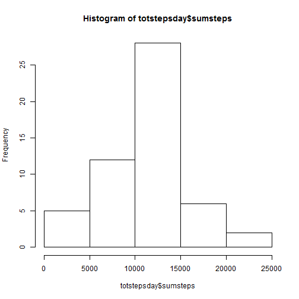
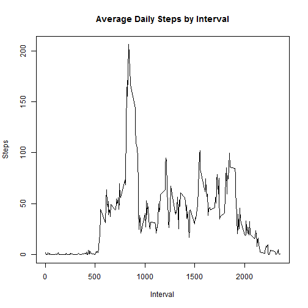
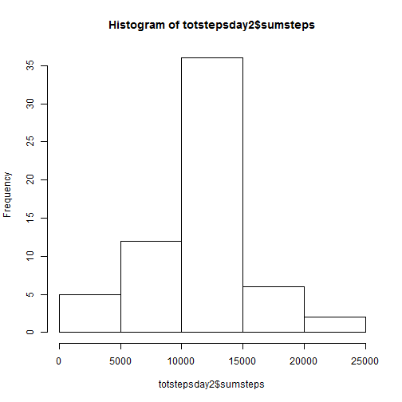
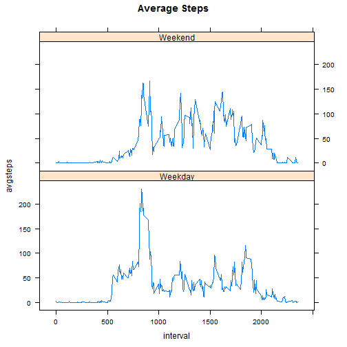

# Reproducible Research: Peer Assessment 1


## Loading and preprocessing the data


```r
setwd("C:/Users/tedco_000/Downloads")
unzip("activity.zip")
d <- read.csv("activity.csv", stringsAsFactors=FALSE, na.strings="NA")
d$date <- as.Date(d$date)
```

## What is mean total number of steps taken per day?


```r
library(sqldf)
```

```
## Loading required package: gsubfn
## Loading required package: proto
## Loading required package: RSQLite
## Loading required package: DBI
## Loading required package: RSQLite.extfuns
```

```r
totstepsday <- sqldf("select date, sum(steps) as sumsteps from d where steps is not null group by 1")
```

```
## Loading required package: tcltk
```

```r
mean(totstepsday$sumsteps)
```

```
## [1] 10766
```

```r
median(totstepsday$sumsteps)
```

```
## [1] 10765
```

## What is the average daily activity pattern?


```r
hist(totstepsday$sumsteps)
```

 

```r
avgstepsint <- sqldf("select interval, avg(steps) as avgsteps from d where steps is not null group by 1")
maxavgstepsint <- sqldf("select interval, avgsteps from avgstepsint where avgsteps in (select max(avgsteps) from avgstepsint)")
maxavgstepsint$interval
```

```
## [1] 835
```

```r
maxavgstepsint$avgsteps
```

```
## [1] 206.2
```

```r
plot(avgstepsint$interval, avgstepsint$avgsteps, type="l", ylab="Steps", xlab="Interval", main="Average Daily Steps by Interval")
```

 

## Imputing missing values 
(imputation using mean steps per interval REDUCED mean/median)


```r
numNa <- sqldf("select count(*) as numNa from d where steps is null")
numNa
```

```
##   numNa
## 1  2304
```

```r
d2 <- sqldf("select coalesce(steps, avgsteps) as steps, date, d.interval from d left join avgstepsint on d.interval=avgstepsint.interval")
totstepsday2 <- sqldf("select date, sum(steps) as sumsteps from d2 where steps is not null group by 1")
mean(totstepsday2$sumsteps)
```

```
## [1] 10750
```

```r
median(totstepsday2$sumsteps)
```

```
## [1] 10641
```

```r
hist(totstepsday2$sumsteps)
```

 

## Are there differences in activity patterns between weekdays and weekends?
(more steps earlier during weekdays - commute to work, perhaps?)

```r
d2$daycat <- ifelse((weekdays(d2$date) == "Sunday") | (weekdays(d2$date) == "Saturday"), "Weekend", "Weekday")
avgstepsdaycatintday <- sqldf("select daycat, interval, avg(steps) as avgsteps from d2 where steps is not null group by 1, 2")
library(lattice)
xyplot(avgsteps~interval|daycat, main="Average Steps", data=avgstepsdaycatintday, layout=(c(1,2)), type="l")
```

 
